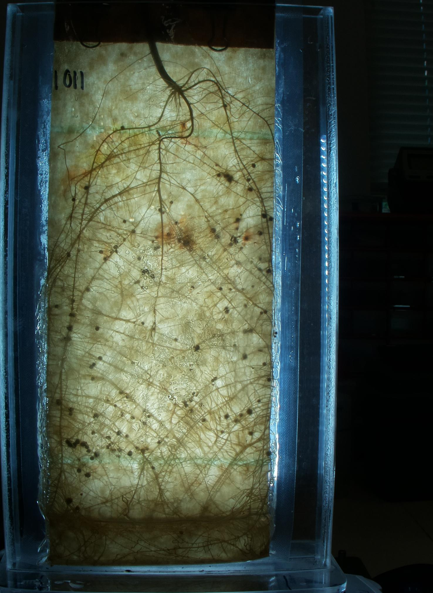
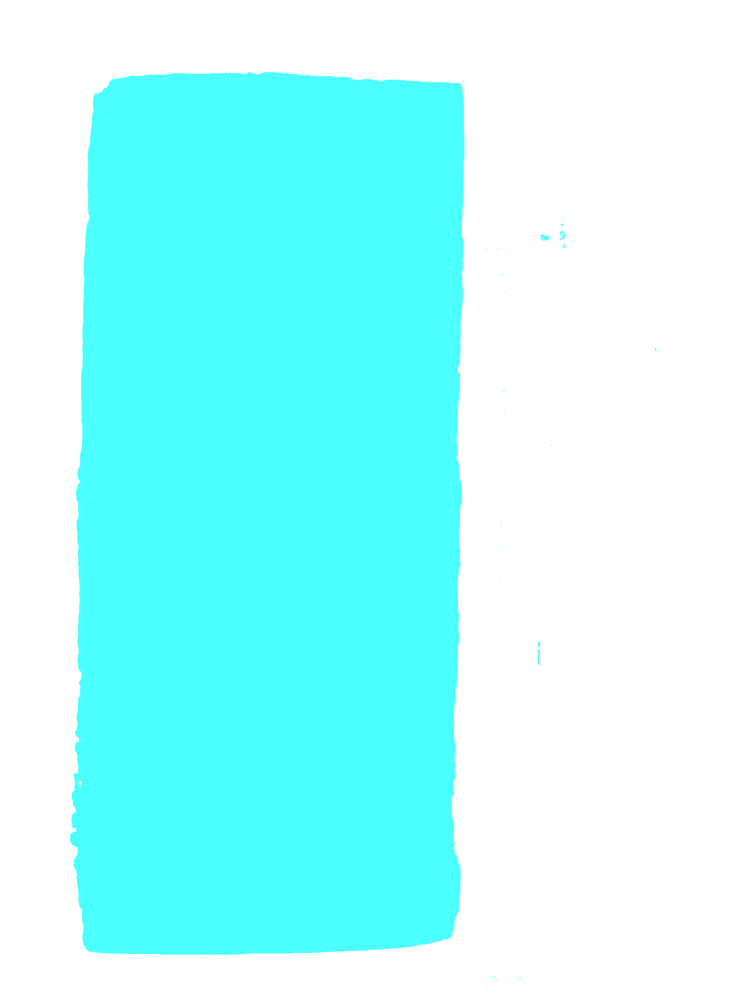
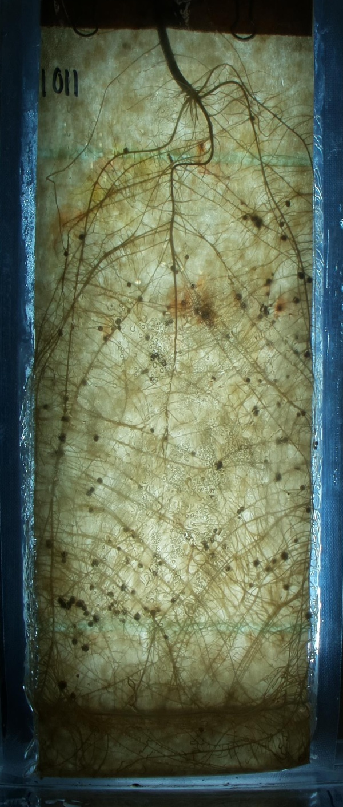
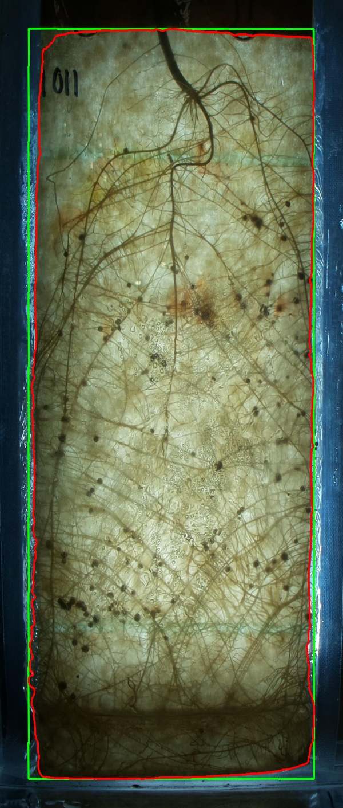
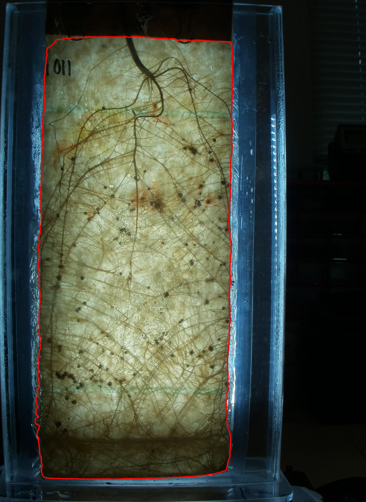
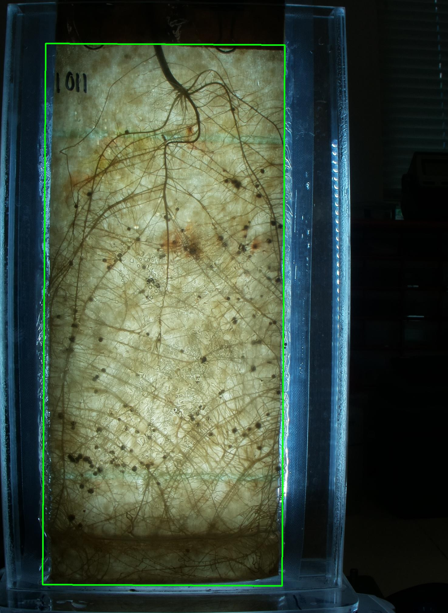

# Perspective-Correction
Automated Perspective Correction using [RootPainter](https://github.com/Abe404/root_painter), deep neural networks, transformation matrixes, OpenCV and Numpy. Uses segmentations created by root painter to frame the water pouch and create a consistent image even with changing camera positions in diferent dates. 


Input: Image & Mask

 


<br><br>

Output: Corrected Image (Extra image with rectangle and outline for illustration purposes)

 


## An Overview of the program 
### Step 1: Create deep neural network activation mask


### Step 2: define the outline of the water pouch


### Step 2: Find 4-sided polygon defining the outline of the water pouch


### Step 3: Calculate transformation matrix
```
Rectangle: ((539.8072509765625, 1037.693359375), (788.491943359375, 1783.570068359375), 0.31373143196105957)


Bounding box: 
[[ 150.45026  143.76295]
 [ 938.93036  148.08032]
 [ 929.16425 1931.6238 ]
 [ 140.68414 1927.3064 ]]

Output width: 600
 Output height: 1410
 Output size: (600, 1410)

Destination points: 
[[  50.   50.]
 [ 549.   50.]
 [ 549. 1359.]
 [  50. 1359.]]

Perspective transformation matrix: 
[[ 6.32844181e-01  3.46525227e-03 -4.57097441e+01]
 [-4.01856651e-03  7.33910218e-01 -5.49045070e+01]
 [ 1.08494211e-11  1.18819831e-13  1.00000000e+00]]

Real image: (2021, 1476, 3)
Warped image: (1410, 600, 3)
```


### Step 4: Transform image using matrix to obtain corrected image

```
Warped image: (1410, 600, 3)
```


Made in colaboration with [R Ford Denison](https://darwinianagriculture.com/)
